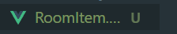

# vue

- node,vscode,yarn 설치
- npm install -g @vue/cli
- vue create 프로젝트명
- npm run serve

# 반복문 데이터바인딩

```
  <a v-for="반복문이름 in 반복횟수" :key="키값">내용</a>
//기본구성

<a v-for="작명 in menu" :key="작명">{{ 작명 }}</a>
     menu:['홈','상품','상세'],


  <div v-for="(v,i) in products" :key="i">
    <h4>{{ v }}</h4>
    <h3>50만원</h3>
  </div>
```

- 01/10

# 컴포넌트 만들기



- 파일생성(파일명 두단어 조합으로 안하면 오류가 뜰 수 있음)

```
<template>
  <div>방팔아요!</div>
</template>
<script>
export default {
  name: "RoomItem",
};
</script>
<style></style>
```

- 호출하는 페이지에서 import/component등록/사용 (3가지 다 해야지 vue가 뭐라안함)

```
<RoomItem />
components: { ModalItem, RoomItem },
```

# v-model

```
<input type="number" v-model="month" />
<input type="number"v-on:input="month = $event.target.value" />
```

# watcher

```
  watch: {
    month(a, b) {
      if (a > 10) this.month = 1;
    },
  },
```

# Transition 애니메이션주기

```
 <Transition name="fade">
    <div class="black-bg" v-if="모달창열렸니">
      <div class="white-bg">
        <h4>{{ 원룸들[누른거].title }}</h4>
        <h3>{{ 원룸들[누른거].content }}</h3>
        <input type="number" v-model="month" />
        개월
        <h3>{{ month }}개월 총 {{ 원룸들[누른거].price * month }}원</h3>

        <button v-on:click="$emit('close')">닫기</button>
      </div>
    </div>
  </Transition>

```

```
.fade-enter-from {
  opacity: 0;
}
.fade-enter-active {
  transition: all 1s;
}
.fade-enter-to {
  opacity: 1;
}
```

# 라이프싸이클훅

```
  mounted() {
    setTimeout(() => {
      this.showDiscount = true;
    }, 2000);
  },
```

- 2초후에 showdiscount라는 data가 true 가 됨
